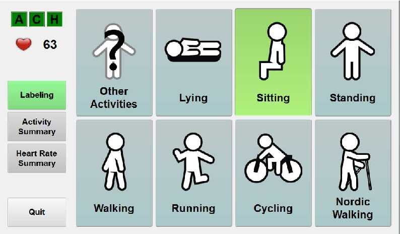

# Project 1

## [Physical activity monitoring](file:///Users/michaelolanipekun/Downloads/DataScienceRM_Report2.html)

Created a tool that  monitor Physical activity in wearable computing research.

collected publibly available data  PAMAP2 Physical Activity Monitoring dataset.

Datasets include the  measurements made by wireless sensors worn by 9 subjects as they performed various physical activities over time such as running, standing, or cycle. 

The  goal for this analysis is to build a model that can predict the given task a subject is performing based on a given measurement.

We performed Data preparation, cleaning, and exploration, is about making sure our data are ready for analysis; Which include dealing missing value denoted with 'NAN' as a result of Missing sensory data due to wireless data dropping. Also we performed Exploratory Data Analysis to help us better investigate our data set discover patterns and detect anomalies to help us formualte and test our hypothesis.Also, this section illustrates how to visualize data.

We fomulated and tested Hypothesis using statistical theories.

 We built both clasification and regression model using both  Linear Regression and Logistics Regression.
  
 #Project 2
 
 I have prepared a visualisation for 140 locations and newly opened stores in 10 new cities locations and have identified the best investment MKT opt.

The data source was provided by kaggle, however I have cleaned and completed the dataset with other information from open sources.

The main goal of the project is to determine the best location for future investments.

After all necessary steps of data cleaning (I had to deal with a lot of missing values) I did some EDA to determine which variables can be useful in my project.

I chose this algorithm just because of my personal experience with it, but keep in mind that I am 100% sure that other models will work just as good (and probably better).

